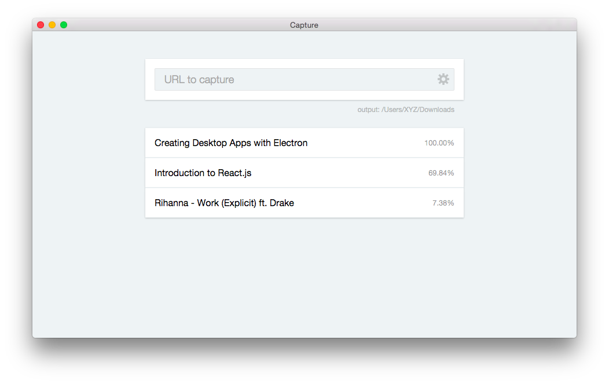

# Capture
> Simple video downloader



## Installation
[**Download that latest version**](https://github.com/epilande/capture/releases/latest), unzip, and move `Capture.app` into your apps folder.


## Development

  1. Install NPM modules.

  ```bash
  $ npm install
  ```

  2. Start local server, webpack, & electron.

  ```bash
  $ npm run dev
  ```
